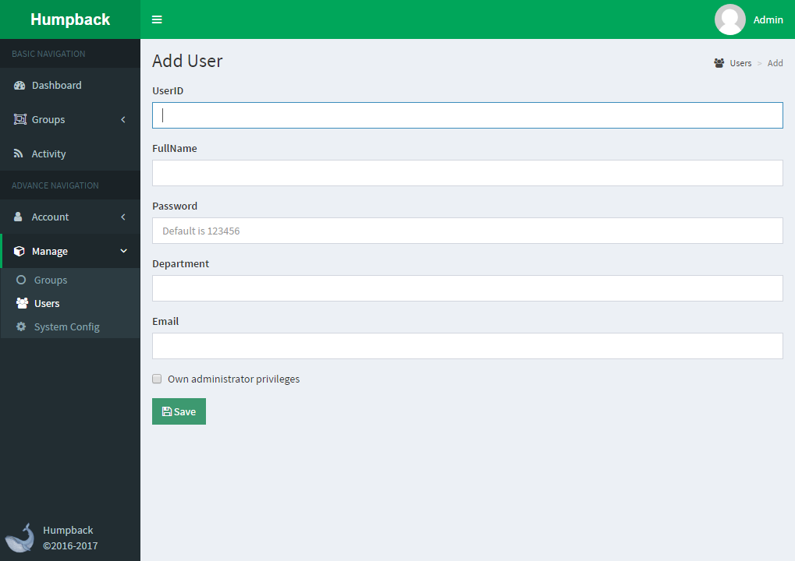

# Add User

> Description

- `UserID`: 4-6-bit string for user login, such as zs18
- `FullName`: Full name of the user, such as zhang san
- `Department`: Optional, the department
- `Email`: Optional, contact email
- `Own administrator privileges`: Do you have `administrator 'permissions?
