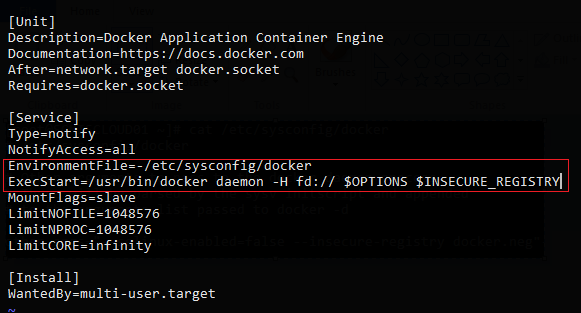
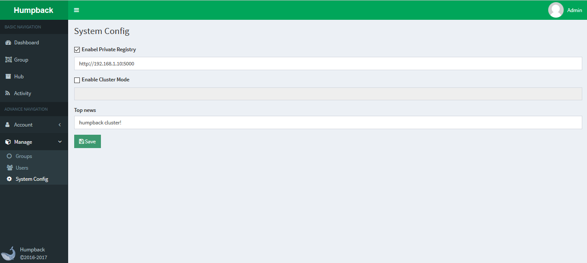

# 私有仓库

&ensp;&ensp;&ensp;私有仓库为 Humpback 提供镜像存储基础服务，Humpback 涉及镜像查询、容器构建等功能都依赖于私有仓库服务。   

##  前提条件   

- Docker 版本为 `1.8.3` 或更高版本   

- Docker 官方仓库 `Distribution`，推荐 `2.5.1` 或更高   

##  启动仓库

&ensp;&ensp;&ensp;本小节主要阐述以容器方式来构建并运行 Docker 私有仓库，采用 `2.5.1` 版本为例。   

&ensp;&ensp;&ensp;Docker 官方仓库 `Distribution` 在 hub.docker.com 的镜像名称为：<a href="https://hub.docker.com/r/library/registry/">`registry` </a>

&ensp;&ensp;&ensp;1、拉取仓库镜像到本地

```bash
$ docker pull registry:2.5.1
```
&ensp;&ensp;&ensp;2、启动仓库服务   

```bash
$ docker run -d -p 5000:5000 --restart=always \
  -v /var/lib/registry/:/var/lib/registry/ \
  -v /etc/docker/registry/config.yml:/etc/docker/registry/config.yml \
  --name registry \
  registry:2.5.1
```
&ensp;&ensp;&ensp;关于仓库配置说明请参见 <a href="https://github.com/docker/distribution/blob/master/docs/configuration.md">`configuration.md` </a>

&ensp;&ensp;&ensp;3、验证仓库服务   

```bash
$ curl http://localhost:5000/v2/_catalog
{"repositories":[]}
```
&ensp;&ensp;&ensp;若能正常访问 `registry` 接口 `_catalog`，证明服务启动成功。 

##  配置 Docker   

&ensp;&ensp;&ensp;若希望 Docker deamon 能从 registry 顺利 `pull` 或 `push` 应用镜像，需要对 Docker 配置进行修改。    

&ensp;&ensp;&ensp;以下配置说明中 `<registry_server>` 为仓库服务器的 IP 地址或主机域名。   

- CentOS 6   

  修改 /etc/sysconfig/docker   

  在 `other_args` 选项中加上 "--insecure-registry `<registry_server>`:5000"

  若没有 `other_args` 选项则为 Docker 版本差异，需找到 `INSECURE_REGISTRY` 选项并修改为：INSECURE_REGISTRY="`<registry_server>`:5000"  

  注：部分 docker 版本 `1.10.x` 或更高已默认为 `CentOS 7` 的安装源，若系统为 `CentOS 7` 还需修改 `docker.service` 文件。   

  在 `CentOS 7` 系统中，首先查看 /usr/lib/systemd/system/docker.service 中是否存在 `EnvironmentFile` 配置。

&ensp;&ensp;&ensp;&ensp;&ensp;   
  
&ensp;&ensp;&ensp;&ensp;&ensp;文件内容可能略有不同，只需要注意红框中的 `EnvironmentFile` 和 `ExecStart` 部分，确保链接到配置文件路径和相关环境变量 `INSECURE_REGISTRY`。

- Ubuntu

  修改 /etc/default/docker

  找到 `INSECURE_REGISTRY` 选项选项修改为：INSECURE_REGISTRY="`<registry_server>`:5000"

&ensp;&ensp;&ensp;配置完毕后重新启动 Docker 本地服务，检查配置是否生效，若进程出现 `--insecure-registry` 参数表明配置生效。

```bash
$ service docker restart
$ ps aux | grep docker
root   5003  1.8  2.0  520284  42360 ?  Ssl  15:59  0:00  /usr/bin/dockerd -H fd:// --insecure-registry 192.168.1.10:5000
```

##  接入到Humpback

    

&ensp;&ensp;&ensp;以管理员身份登录 Humpback，展开左侧 `Manage` 点击 `System Config`，进入系统配置界面，将 `Enabel Private Registry` 勾选，并填入私有仓库服务地址 `Save` 即可。    
