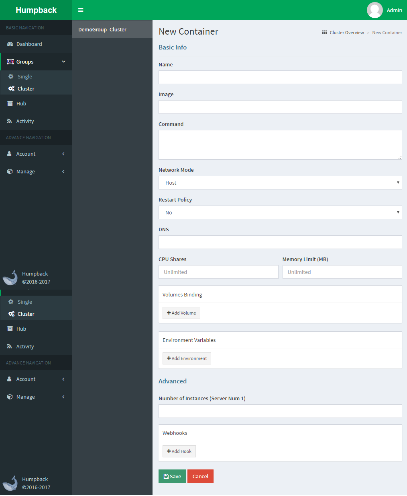

# Create Container

Creating a container under a cluster is consistent with creating a container on a single server, but you need to specify the number of `instances` in cluster mode, You can also configure `Webhook` to receive the distribution results after the container has changed
