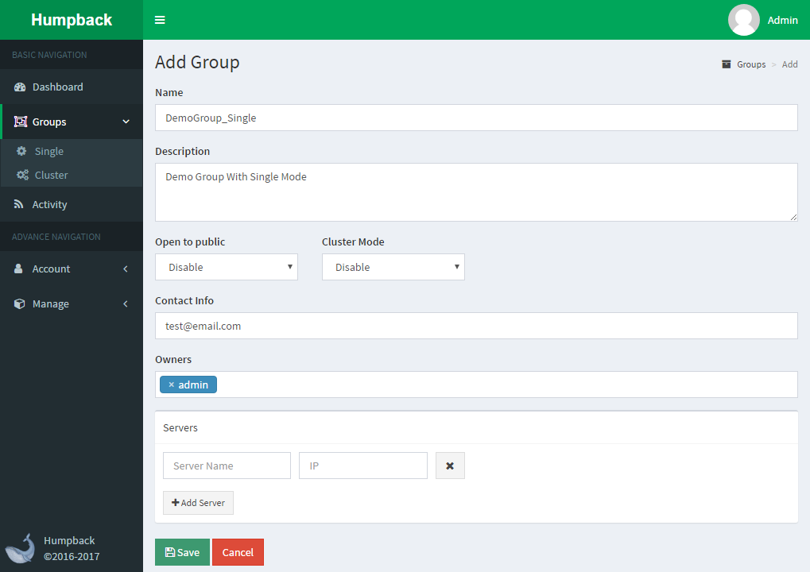

# 创建分组

> 说明

- `Open To Public`: 是否将此Group开放给所有用户使用，否则只能`Owners`使用
- `Cluster Mode`: 是否将此Group作为一个集群来管理（拥有容器调度等集群化功能），此功能需要站点管理员在`System Config`页面将`Enable Cluster Mode`开启
- `Owners`: 在未启用Open To Public的情况下仅有配置的User才能操作此Group
- `Server`: `Server Name`和`IP`任填一个，也可两个都填写，优先使用IP访问