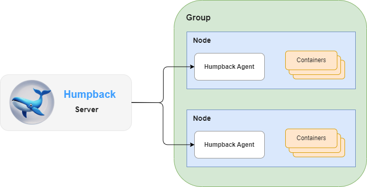

# Humpback Architecture

Humpback consists of two compoments: the Humpback Server and the Humpback Agent. Both run as lightweight containers on your existing containerized infrastructure. The Humpback Agent should be deployed to each node in your cluster and configured to report back to the Humpback Server container.

