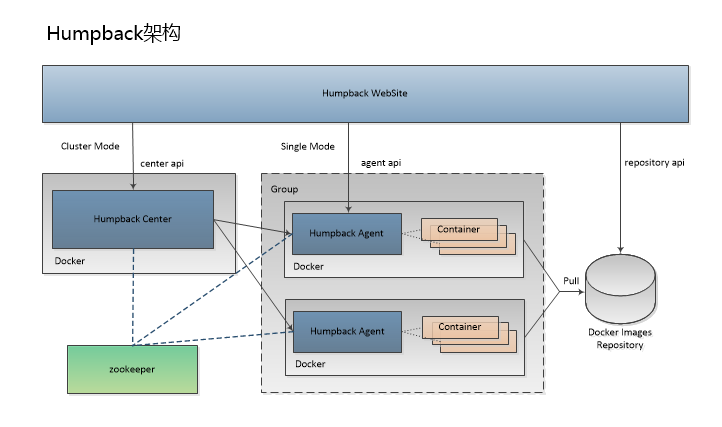

# Humpback架构

## 系统角色

- `Humpback Website`  
   Humpback 管理站点，主要提供系统可视化管理，功能为分组管理，权限管理，仓库镜像查询，集群管理。

- `Humpback Center`  
   Humpback 集群中心，通过调度策略对集群实施容器批量创建、操作、删除、升级、故障迁移、实例调整等功能；同时负责集群节点的发现与管理。   

- `Humpback Agent`   
   Humpback 集群节点，集群中存在多个节点等待被调度，并在 `Humpback Center` 中被分组管理，通过节点发现模块注册到集群中心并维持心跳。    
   
   在管理分组时可以将 `Humpback Agent` 节点对应的 IP 地址加入到多个分组中，当发生容器调度时，组与组之间容器相互隔离互不影响。

## 工具集  
   
- `Zookeeper`   

   Humpback 默认选用 `Zookeeper` 来进行集群节点的注册和发现，后端需要具备一个 `Zookeeper` 集群。   
   
   默认版本 `3.4.6`，下載 <a href="http://apache.org/dist/zookeeper/zookeeper-3.4.6/zookeeper-3.4.6.tar.gz">`zookeeper-3.4.6.tar.gz`</a>
   
- `Docker Images Repository`   
 
   Humpack 选用 `Docker` 官方私有镜像仓库 `distribution` 来提供镜像存储服务，`Humpback Website` 通过访问 `distribution` API 来提供仓库镜像查询功能。   
      
   默认版本 `2.5.1` 或更高，更多参见 <a href="https://github.com/docker/distribution/blob/master/README.md">`Docker Distribution`</a>