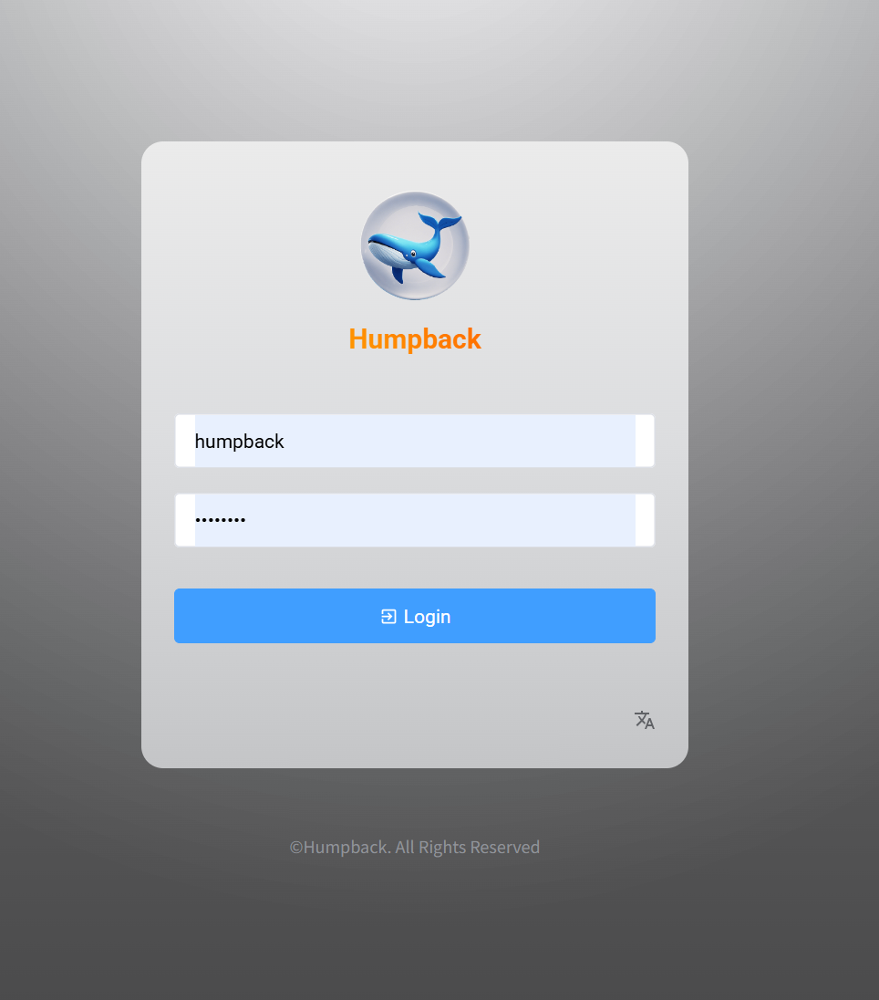
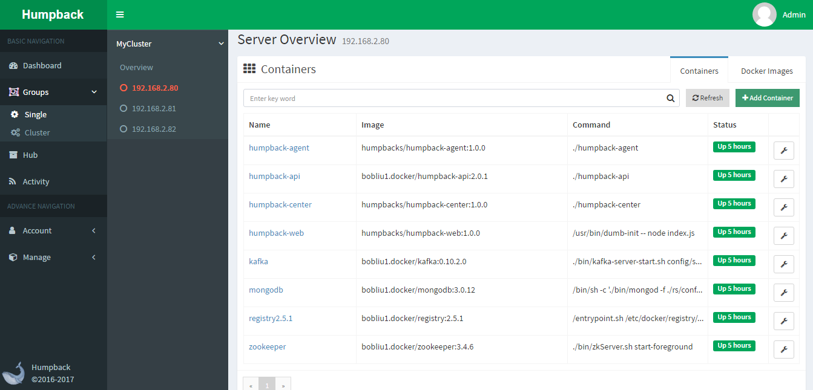
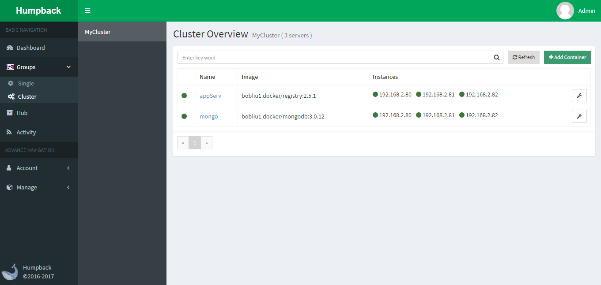
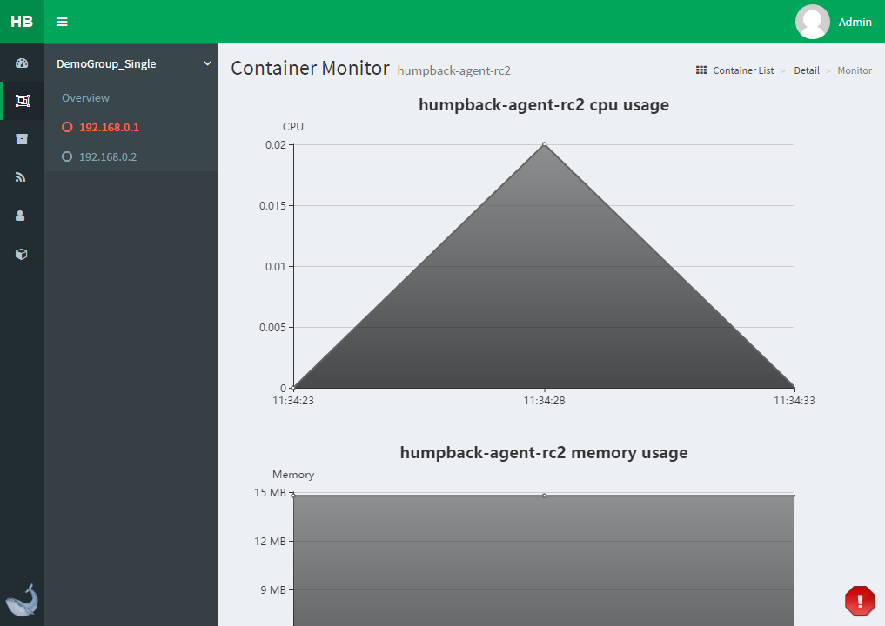
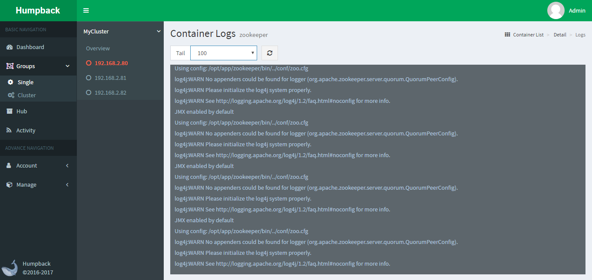
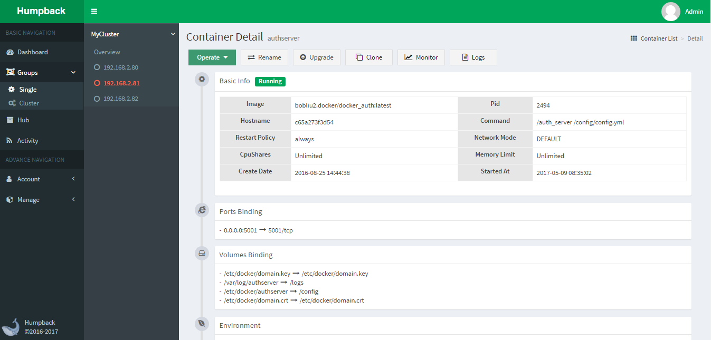
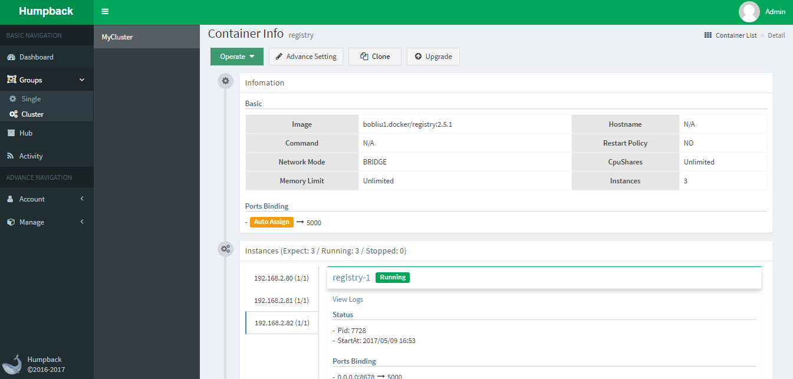

# Humpback

## 什么是 Humpback?

&ensp;&ensp;&ensp;Humpback 可以帮助企业快速搭建轻量级的 Docker 容器云管理平台，若将你的 Docker 主机接入到 Humpback 平台中，就能够为你带来更快捷稳定的容器操作体验。 

## Humpback 功能特点

- Web操作，简单易用
- 权限分组隔离
- 容器升级与克隆
- 容器监控
- 容器日志
- 集群容器调度
- 集群弹性伸缩
- 私有仓库

## Humpback 模式介绍
- `Single Mode`   
  单一模式，对单组主机实现容器管理，提供容器创建，容器操作，容器重命名，容器升级与克隆，容器监控，容器日志输出等功能。   

- `Cluster Mode`   
  容器集群模式，实现按实例数批量创建容器，容器调度，批量操作容器，升级和迁移等。 

&ensp;&ensp;&ensp;平台采用分组方式（Group）来管理多主机，多组之间权限操作隔离，同时也可以将一台主机加入到多个分组中交叉管理。

Single Mode

Cluster Mode

Container Monitor

Container Logs

Container Detail

&ensp;&ensp;&ensp;项目地址：<a href="https://humpback.github.io/humpback">https://humpback.github.io/humpback</a> 

&ensp;&ensp;&ensp;Docker版本：Docker 1.8.3 或更高

&ensp;&ensp;&ensp;开发授权协议: Apache 2.0   

&ensp;&ensp;&ensp;开发语言: Angular2、Golang   

&ensp;&ensp;&ensp;操作系统: 跨平台

