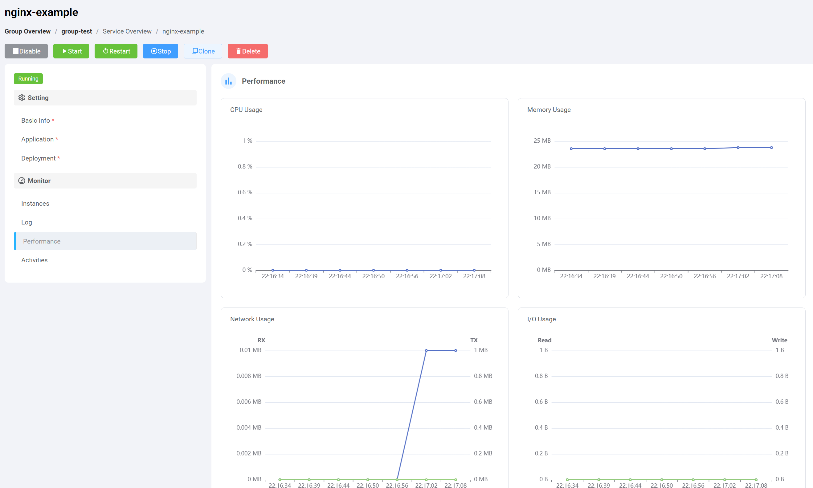

# Humpback

## What is Humpback?

&ensp;&ensp;&ensp;Humpback 可以帮助企业快速搭建轻量级的 Docker 容器云管理平台，若将你的 Docker 主机接入到 Humpback 平台中，就能够为你带来更快捷稳定的容器操作体验。 

## Humpback features

- Web operation, easy to use
- Permission grouping isolation
- Container upgrades and clones
- Container monitoring
- Container log
- Cluster container scheduling
- Clustering flexibility
- Private registry

## Humpback mode introduction
- `Single Mode`   
  Single mode is a container management for a single set of hosts. It provides container creation, container operation, container renaming, container upgrades and cloning, container monitoring, container log output and other functions.   

- `Cluster Mode`   
  Container cluster mode, to achieve create containers in bulk by number of instances and container scheduling, bulk operation of the container, upgrades, migration and so on.

&ensp;&ensp;&ensp;平台采用分组方式（Group）来管理多主机，多组之间权限操作隔离，同时也可以将一台主机加入到多个分组中交叉管理。The platform uses Group (Group) to manage multi-host. Multiple groups of permissions between the operation is isolated, you can also add a host to multiple groups of cross-management.

Single Mode

Cluster Mode

Container Monitor

Container Logs

Container Detail

&ensp;&ensp;&ensp;Project address:<a href="https://humpback.github.io/humpback">https://humpback.github.io/humpback</a> 

&ensp;&ensp;&ensp;Docker version: Docker 1.8.3 or higher

&ensp;&ensp;&ensp;Development License Agreement: Apache 2.0   

&ensp;&ensp;&ensp;Development language: Angular2, Golang   

&ensp;&ensp;&ensp;Operating system: cross platform

