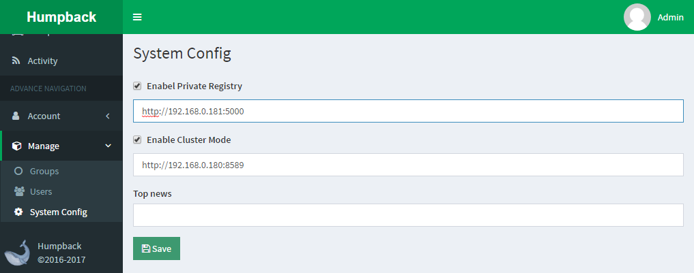
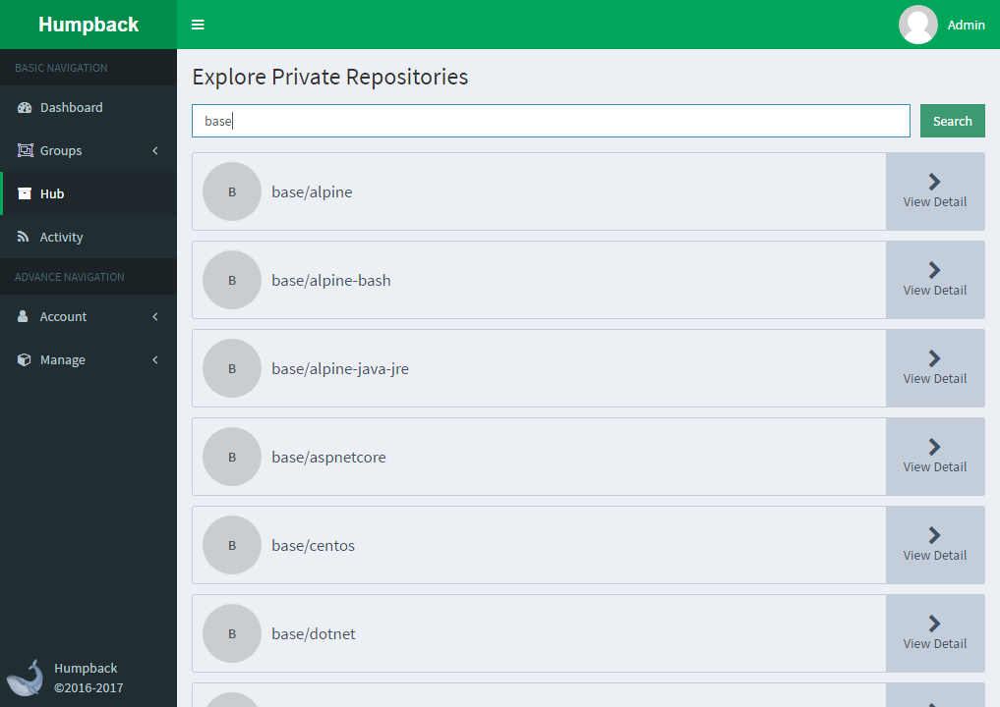
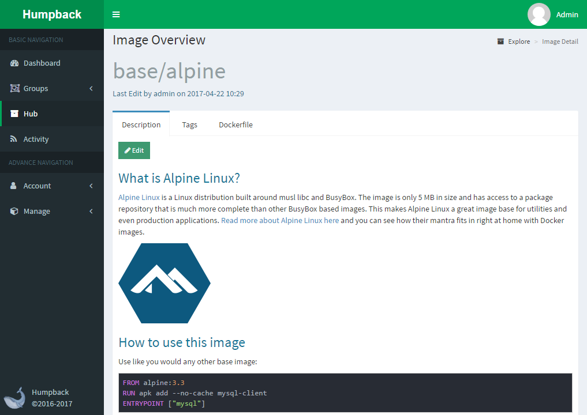
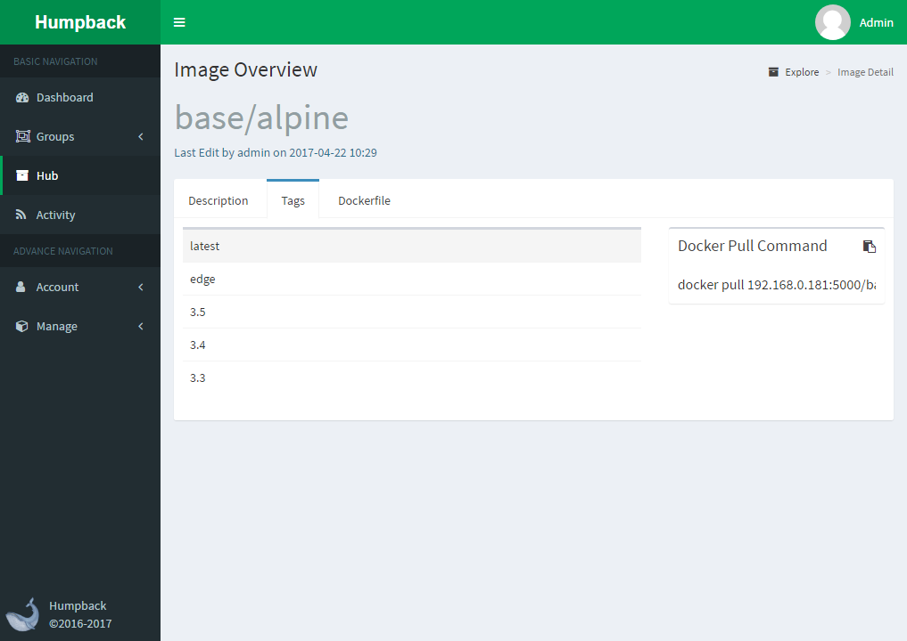
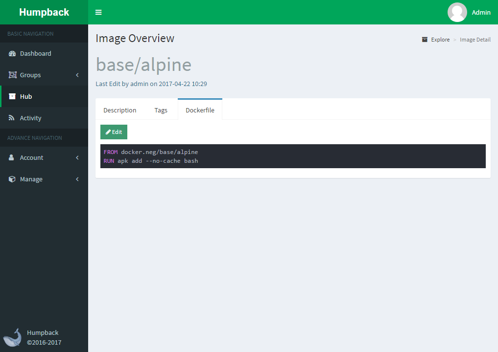

# Manage The Image

> Private registry address setting [Private registry structures](build-registry.md)

> Browse the image list

View the docker image inside the registry, click `View Detail` to view the image description, Tag, Dockerfile and other information, which describes and Dockerfile need to maintain

> Image description

Use Markdown maintenance, mainly used to describe the image use

> Tag list

As Docker official private registry can read the image information is limited, so only show the tag

> Dockerfile

Maintain the build image using Dockerfile to make it easier for users to view the constructing steps
