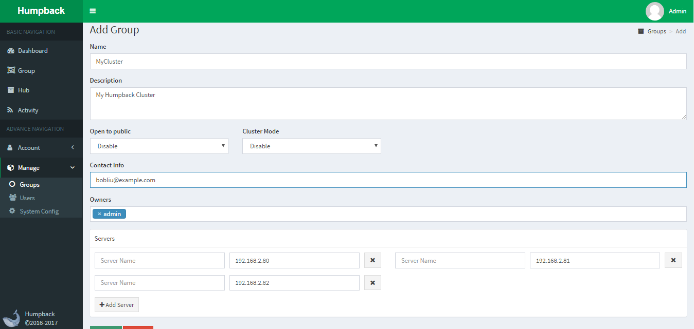
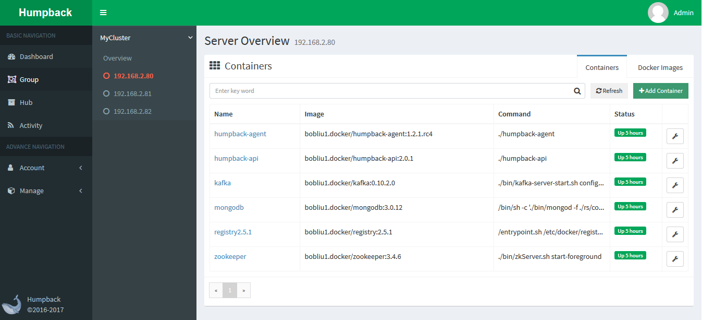

# 部署 Humpback Agent 

> Humpback Agent 

&ensp;&ensp;&ensp; 三台服务器：192.168.2.80, 192.168.2.81, 192.168.2.82 都需要部署 Humpback Agent 用于实现本地镜像、容器管理。

- 检查 Docker 版本

&ensp;&ensp;&ensp; 首先检查 `Docker API` 版本号：`1.21`，注意不同 Docker 版本，版本号有所区别。

```bash
$ docker version
Client:
 Version:      1.9.1
 API version:  1.21
 Go version:   go1.4.3
 Git commit:   a34a1d5
 Built:        Fri Nov 20 17:56:04 UTC 2015
 OS/Arch:      linux/amd64

Server:
 Version:      1.9.1
 API version:  1.21
 Go version:   go1.4.3
 Git commit:   a34a1d5
 Built:        Fri Nov 20 17:56:04 UTC 2015
 OS/Arch:      linux/amd64
```

- 启动 Humpback Agent

&ensp;&ensp;&ensp; 1、集群模式启动
```bash 
$ docker pull humpbacks/humpback-agent:1.0.0
$ docker run -d -ti --net=host --restart=always \
 --name=humpback-agent \
 -e DOCKER_API_VERSION=v1.21 \
 -e DOCKER_CLUSTER_ENABLED=true \
 -e DOCKER_CLUSTER_URIS=zk://192.168.2.80:2181,192.168.2.81:2181,192.168.2.82:2181 \
 -e DOCKER_CLUSTER_NAME=humpback/center \
 -v /var/run/:/var/run/:rw \
 humpbacks/humpback-agent:1.0.0
$ docker ps -a
CONTAINER ID    IMAGE                           COMMAND               CREATED        STATUS         PORTS         NAMES
b1ac4a82c2dd    humpbacks/humpback-agent:1.0.0   "./humpback-agent"   3 minutes ago  20 seconds ago               humpback-agent
```
&ensp;&ensp;&ensp; 2、非集群模式启动
```bash 
$ docker pull humpbacks/humpback-agent:1.0.0
$ docker run -d -ti --net=host --restart=always \
 --name=humpback-agent \
 -e DOCKER_API_VERSION=v1.21 \
 -v /var/run/:/var/run/:rw \
 humpbacks/humpback-agent:1.0.0
$ docker ps -a
CONTAINER ID    IMAGE                           COMMAND               CREATED        STATUS         PORTS         NAMES
b1ac4a82c2dd    humpbacks/humpback-agent:1.0.0   "./humpback-agent"   3 minutes ago  20 seconds ago               humpback-agent
```

- 环境变量与参数

&ensp;&ensp;&ensp;`DOCKER_API_VERSION=v1.21` 一定要与上面的版本号对应一致。   

&ensp;&ensp;&ensp;`DOCKER_CLUSTER_ENABLED=true` 如果当前 Agent 需要被集群模式调度， 那么 `Cluster Mode` 模式请设置为 `true`，否则关闭集群调度该节点为 `Single Mode` 模式。   

&ensp;&ensp;&ensp;`DOCKER_CLUSTER_URIS=zk://192.168.2.80:2181,192.168.2.81:2181,192.168.2.82:2181` 为先前配置的 `Zookeeper` 集群地址信息。   

&ensp;&ensp;&ensp;`DOCKER_CLUSTER_NAME=humpback/center` 集群名称，要与 `Humpback Center` 配置一致。

- 创建分组，注册服务器

&ensp;&ensp;&ensp;三台服务器都成功启动 `Humpback Agent` 容器后，进入 `Humpback Web` 站点，展开左侧 `Manage` 功能点击 `Groups` 创建一个分组：`MyCluster`   

&ensp;&ensp;&ensp;并将三台节点服务器加入到该组中并点击 `Save` 即可。



&ensp;&ensp;&ensp;进入分组页面，可以查看三台集群服务器信息。



- [如何创建容器](single-create-container.md)

- [如何管理容器](single-manage-container.md)

- [批量操作](single-batch-operate.md)