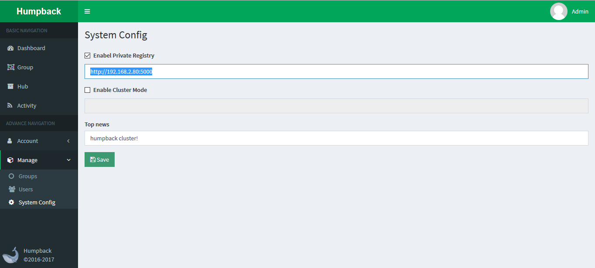

# Deploy The Humpback Site

> Humpback Web    

&ensp;&ensp;&ensp;With 192.168.2.80 as the Humpback Web site server to start, set the port: 8012.

&ensp;&ensp;&ensp;Site default access port: 80, if you want to customize the port, please specify `-e HUMPBACK_LISTEN_PORT = XXXX` when the container is created.   

&ensp;&ensp;&ensp;`/opt/app/humpback-web/dbFiles` file for the Humpback system persistent data files, will store site management and grouping information, please save after the start.

```bash
$ ssh root@192.168.2.80
$ mkdir -p /opt/app/humpback-web
$ docker run -d --net=host --restart=always \
 -e HUMPBACK_LISTEN_PORT=8012 \
 -v /opt/app/humpback-web/dbFiles:/humpback-web/dbFiles \
 --name humpback-web \
 humpbacks/humpback-web:1.0.0
```

&ensp;&ensp;&ensp;Access the site, open the browser input: http://192.168.2.80:8012    

&ensp;&ensp;&ensp;Default Account: admin Password: 123456   


&ensp;&ensp;&ensp;Log in to Humpback as an administrator and expand the left `Manage` and click `System Config`. Enter the system configuration interface, check the `Enable Private Registry`, and fill in the previously deployed private registry service address `http: //192.168.2.80: 5000` and `Save`. 


