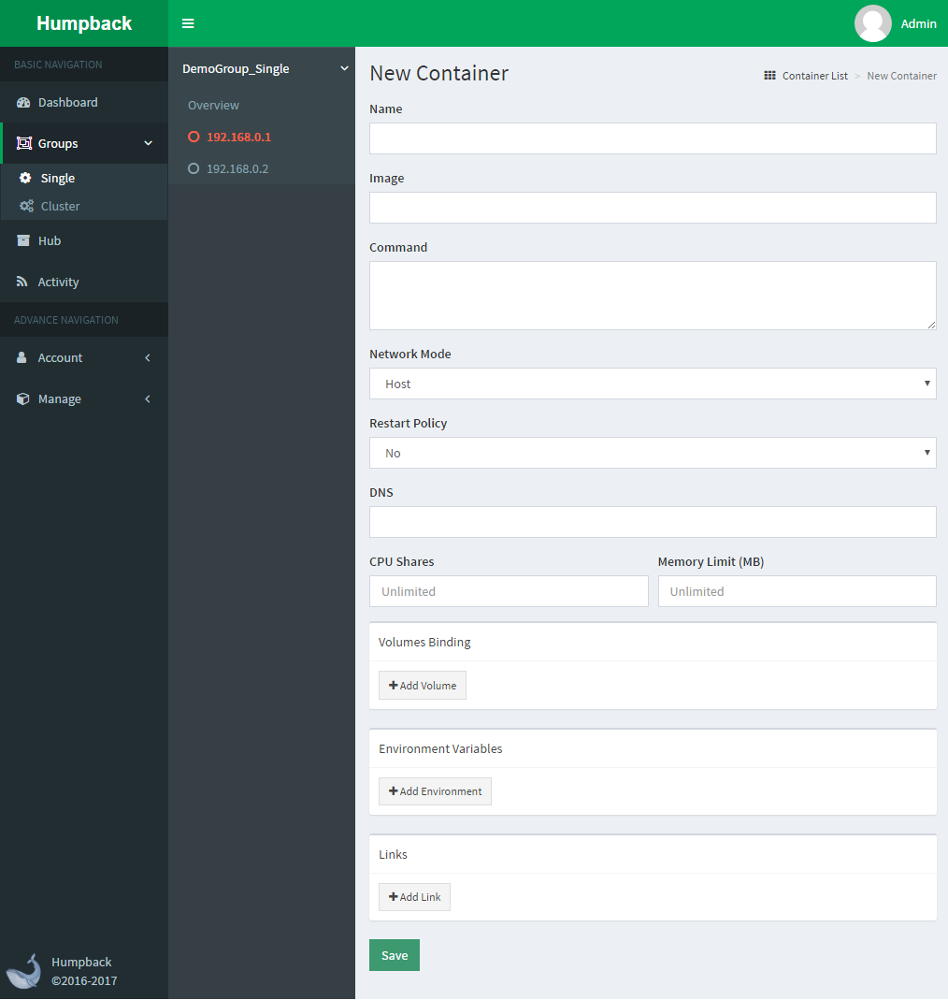

# 创建容器

> 说明

- `Name`: 容器名称
- `Image`:  创建容器所用的镜像名称，如 docker.io/helloworld:latest
- `Command`: 运行容器所使用的命令，为空则使用Dockerfile中预定义的命令
- `Network Mode`: 网络模式，`Host`（直接使用主机网络）、`Bridge`（通过Docker网卡映射到主机网络）、`Customer`（使用自定义网络，需要指定`Network Name`）
  - `Network Name`: 当`Network Mode`是`Customer`是可以设置
  - `HostName`: 当`Network Mode`不是`Host`是可以设置
- `Restart Policy`: 当容器退出是的重启策略，`always`无论容器是在何种情况（除用户手动停止外）退出都会重启，`on-failure`是只有当容器异常退出是才会重启（退出码不为0），默认为`none`不重启
  - `Max Retry Count`: 当`Restart Policy`为`on-failure`是需要指定最大重试次数
- `DNS`: 容器需要使用的DNS服务器
- `CPU Shares`: 指定当前容器相对于其他容器的CPU使用权重
- `Memory Limit`: 最大可用内存
- `Ports Binging`: 当`Network Mode`不是`Host`可以设置端口映射
- `Volumes Binding`: 容器卷标映射
- `Environment Variables`: 设置容器环境变量，如 "VAR=value".
- `Links`:  容器与容器之间的链接，如 container_name:alias