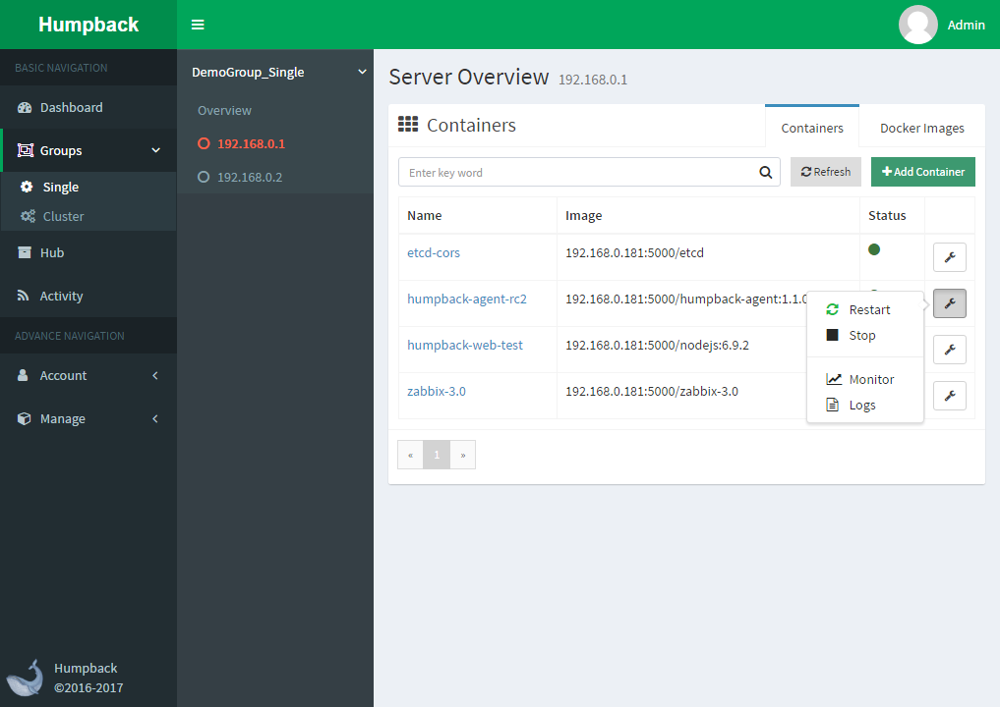
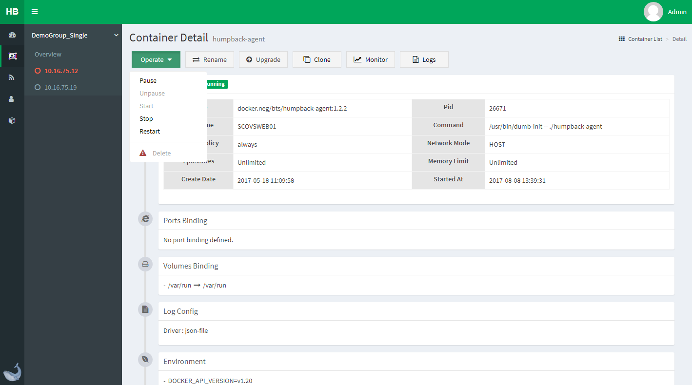
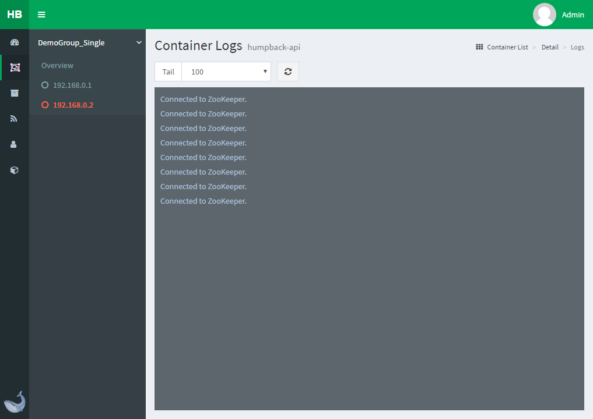

# Container Management

> Container list

Through the list can view all the containers running on the current server, You can do some operations such as starting, stopping and deleting it, you can quickly jump to the container monitoring and log viewing page
*Depending on the screen resolution, the data displayed by the list may be slightly different*

> Container details

Compared to the `container list`, there will be more detailed container information, including Pid, port, volume and other content, in addition to the basic (Start / Stop / Restart / Pause / UnPause / Delete) and other functions, there are `Rename` , `Upgrade` and other functions

- `Rename`：Modify the container name
- `Upgrade`：Up / down the using image of container, the current group of servers can be batch operation, provided that the container name needs to be consistent

> Container monitoring

Provides monitoring of container CPU and memory

> Container log

You can determine how many bars to display based on the Tail value
