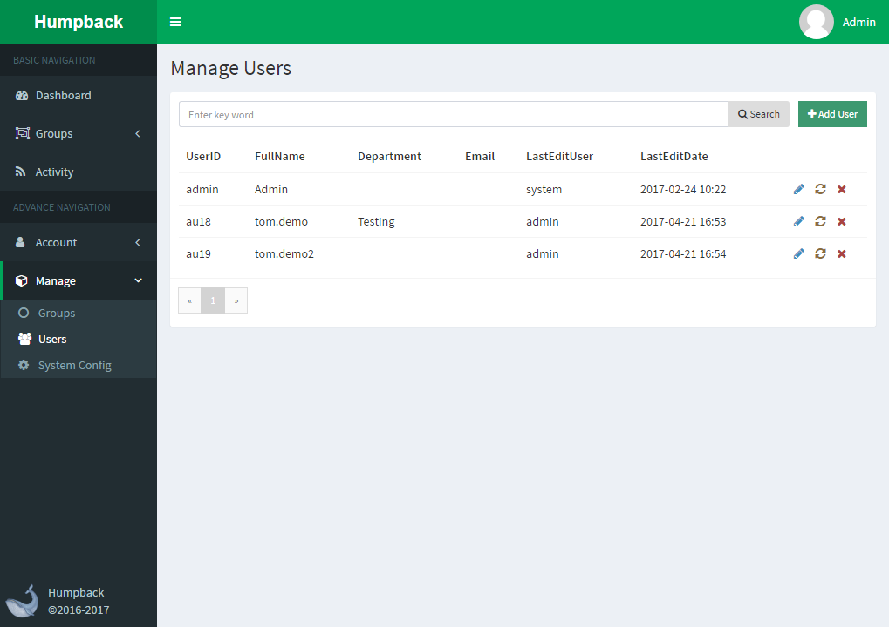

# User List

*User only **Administrator** Permissions for user access*

> Description

- To add a user, click the `Add User` button at the top of the page
- The three icons in the last column of the table represent `edit user information`, `reset user password`, `delete user '
