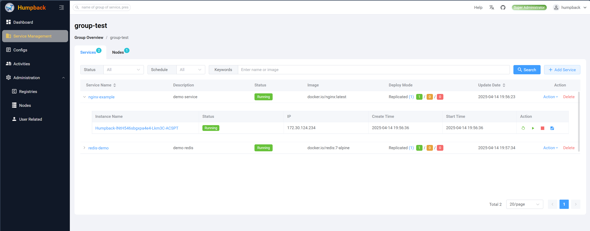
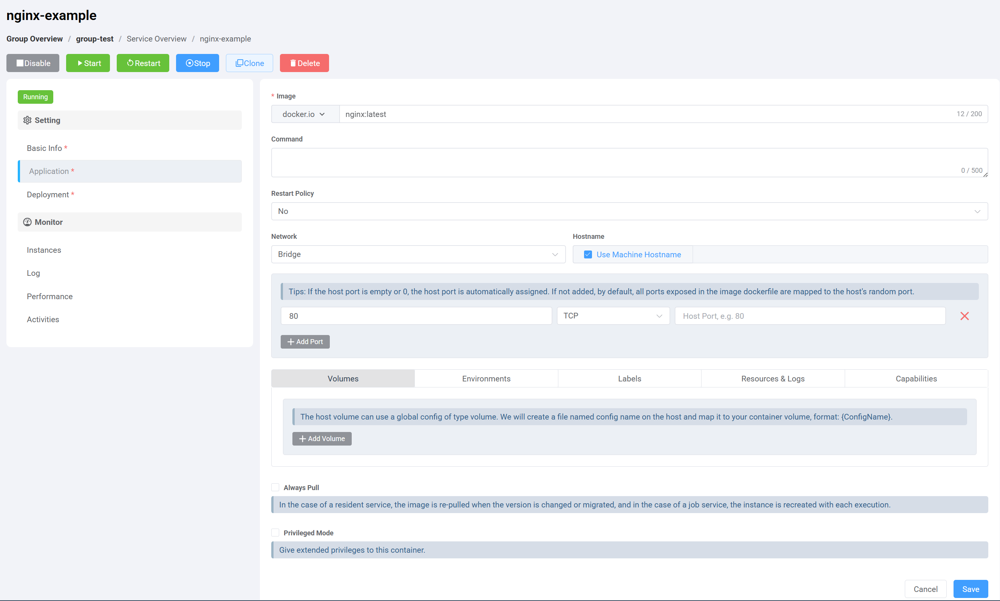

# 创建服务

## 组（Group）

> 创建服务前需要先创建一个组

组是一种将集群资源划分为多个虚拟集群的机制，其功能类似于 `Kubernetes 命名空间`。  

创建组后，您可以向其添加 `节点（nodes）`。  

您还可以通过添加具有管理权限的 `用户（users）` 或 `团队（teams）` 来配置组权限。  

完成组设置后，即可开始创建服务。  

## 服务（Service）

> 服务: 容器管理的核心对象

​​服务是用于管理容器的核心对象，由以下组件构成：

- ​容器配置（Container Configuration）​​：定义容器的各项参数与规格
- ​副本集（ReplicaSet）​​：设定需要创建的容器实例数量
- ​部署策略（Deployment Strategy）​​：指定容器在集群中的调度方式

## 服务状态定义

服务有下面三种状态：

- `调度中`​​: 当前服务的状态没有达到期望的状态，Humpback正在调度中。
- `运行中`​​: 当前服务的状态已经达到期望的状态，服务运行正常。
- `异常`​​: 当前服务出现了异常，无法达到期望状态，需要检查。

## 设定容器参数

在服务应用设置页面，你可以设定容器的各种选项和配置项。

